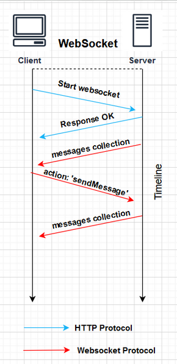
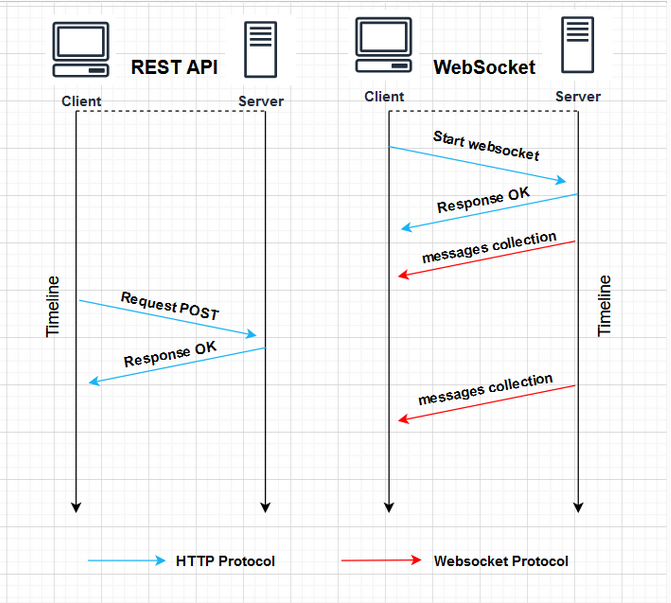

# WebSocket MERN Project

## Overview

This project is a messaging application built using the MERN stack (MongoDB, Express.js, React, and Node.js) with integrated WebSocket functionality. It allows real-time messaging and communication between users, providing a dynamic and interactive experience. The MongoDB has two collections: users and messages. Everytime there is modification in "messages" collection, WebSocket broadcast updated "messages" collection to all connected users.

## Methods

### Method 1: WebSocket Only

In this approach, WebSocket is utilized solely for handling real-time messaging. The server manages all incoming messages and broadcasts them to connected clients. This allows for instantaneous communication without requiring additional API calls for message updates.

**Key Features:**
- Establishes WebSocket connection for real-time updates.
- Listens for incoming messages and broadcasts them to all connected clients.
- Provides an efficient way to manage messaging without additional overhead from REST API calls.

### Method 2: REST API + WebSocket

In this approach, both REST API and WebSocket are employed. The REST API is used for sending messages and editing "messages" collection, while WebSocket is leveraged for broadcasting updated "messages" to clients. This method allows for a more structured approach to data management, enabling easier interaction through standard HTTP requests.

**Key Features:**
- Uses REST API for CRUD operations on "messages".
- Integrates WebSocket to handle real-time message broadcasting.

